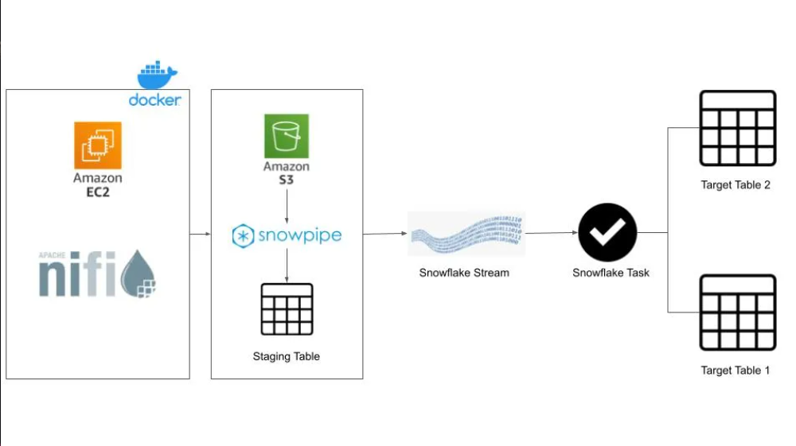

# snowflake-realtime-data-streaming
This project was made to stream realtime data using Apache nifi, AWS, Snowpipe, Stream &amp; Task

## Workflow

## Services used
1) Python (Jupyter) - Using Faker package generated customer data
   

3) Docker - used an docker image to use jupyter and apache nifi
4) Apache nifi - To automate loading data from jupyter kernel to amazon S3.
   

6) AWS EC2 - created an EC2 instance to run Apache nifi and execute python file that generates data
7) AWS S3 - To store the generated customer data
   

9) Snowflake - To Run DML commands and stage the generated csv files from S3
10) Snowpipe -  to automatically load data into database
    

12) Snowstream - to handle SCDs in the data files.
13) Snowtask - to automate the merge data task in database

## Installed Packages
1. pip install Faker

## Project Execution
Create data using python Faker package -> Load the data into AWS S3 using apache Nifi -> Stage the Data from S3 into Snowflake -> Load the data into snowflake database using snowpipe and snowstream for SCD's
